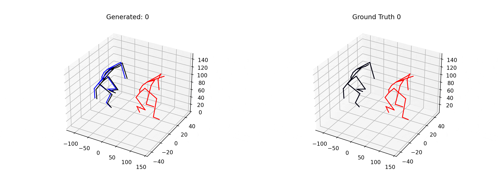
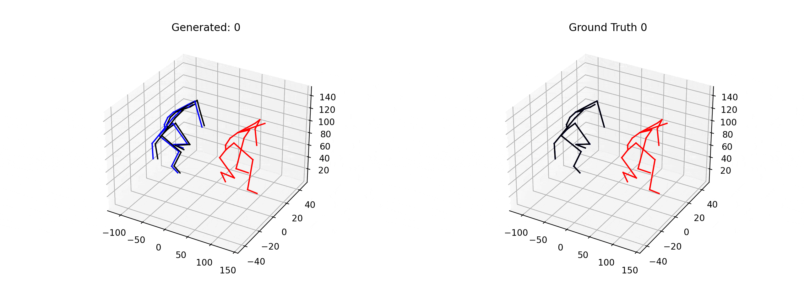
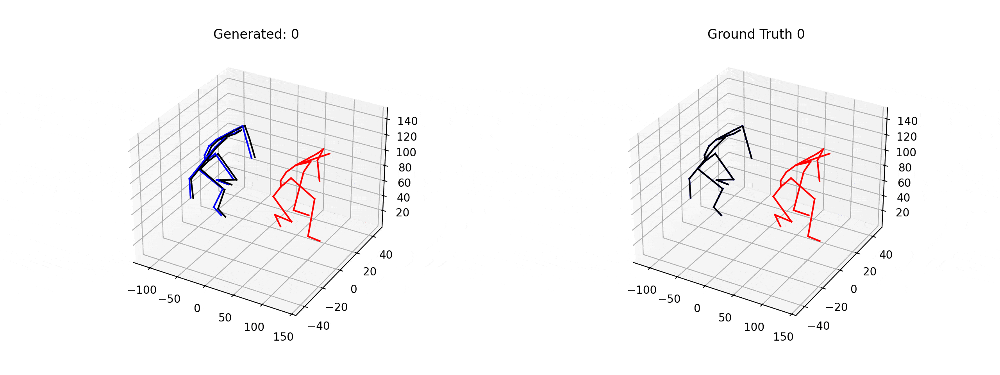
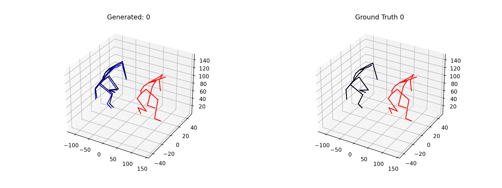

# Robust-Motion-In-betweening-with-Conditioning

This is a simple experiment with conditioned motion based on Robust Motion In-betweening.

Code is based on the implemenation of [Robust Motion In-betweening](https://github.com/jihoonerd/Robust-Motion-In-betweening)

During training, input embedding of motion is appended with 2 additional vector, [1, 0] for dancing motions and [0, 1] for jumping motions. Surprisingly, this simple modification successfully conditioned motion generation process. During generation stage, the additional vector is conditioned by [1, 0], then dancing-like motion is blended with original motion. Same goes for jumping motion too.

## Demo

### Original Motion

 

### Conditioned by Dancing [5, 0]

### Conditioned by Jumping [0, 5]

### Mixed by [5, 5]

